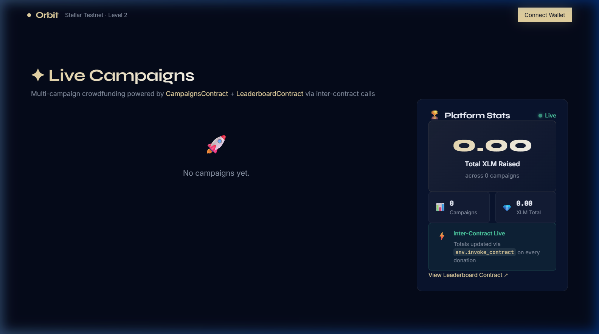
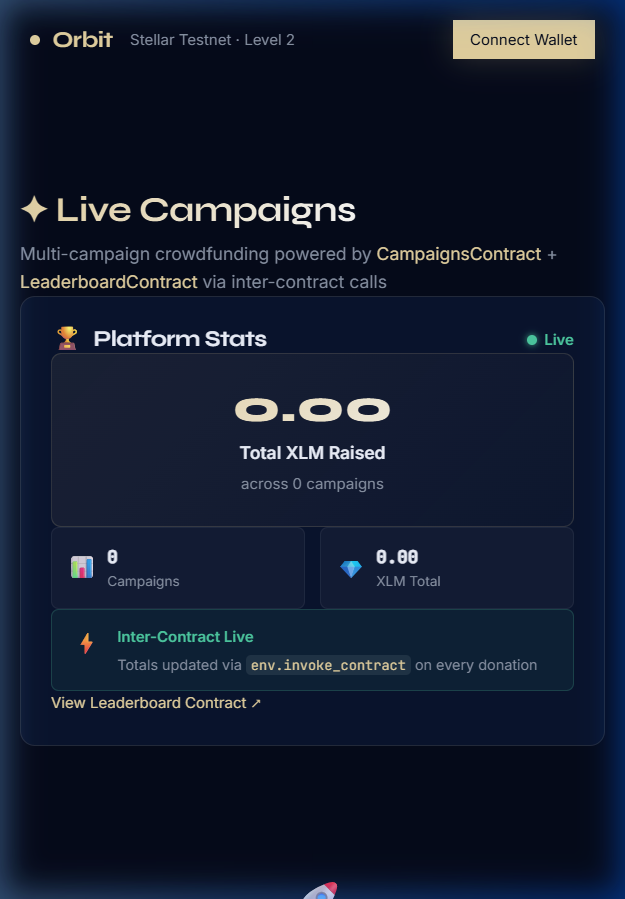
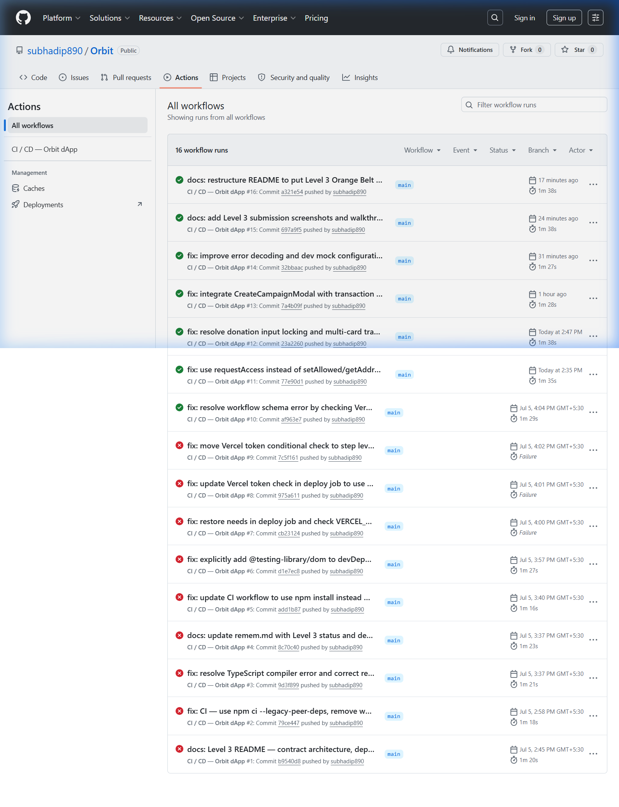
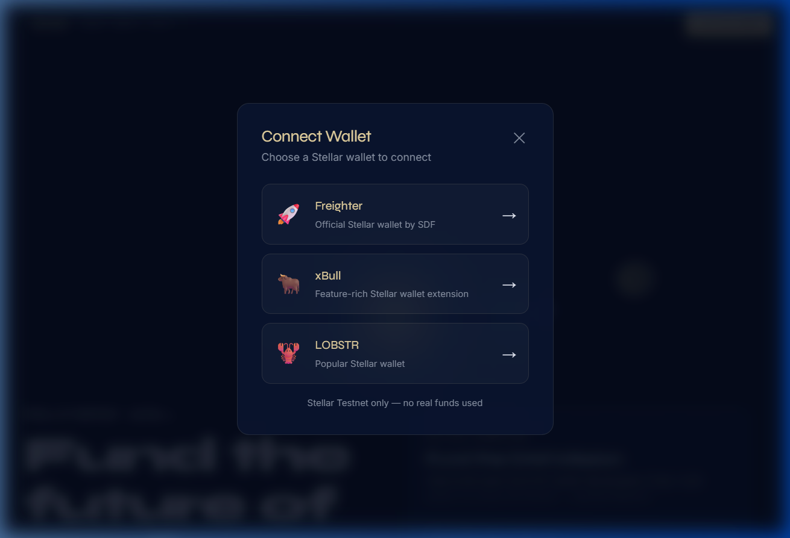
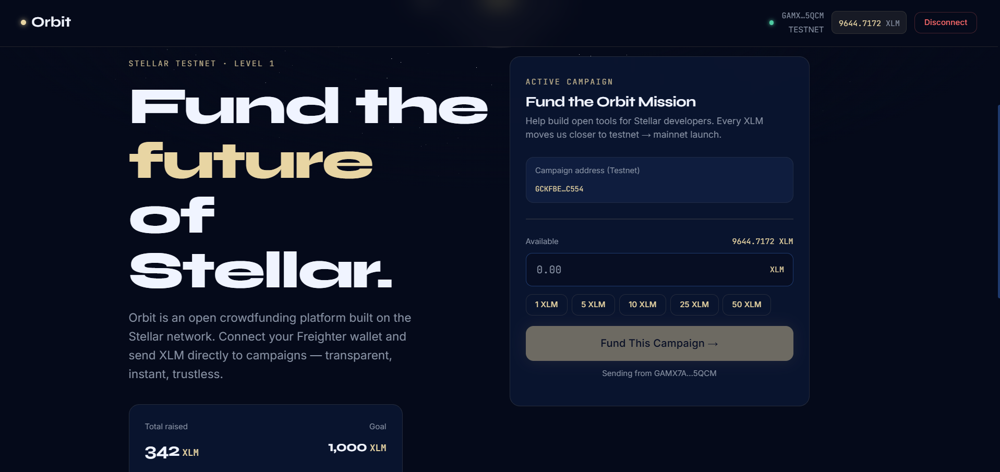

# Orbit — Stellar Crowdfunding Platform

Orbit is a decentralized crowdfunding platform built on the Stellar network. Connect your Freighter, xBull, or LOBSTR wallet to launch fundraising campaigns or donate XLM directly to active missions — transparently, instantly, and trustlessly.

🚀 **Live Deployment URL**: [https://orbit-smoky-kappa.vercel.app/](https://orbit-smoky-kappa.vercel.app/)

---

## 🏆 Project Belt Status

| Level | Belt | Status | Focus |
| :--- | :--- | :--- | :--- |
| **Level 1** | ⬜ White Belt | ✅ Complete | Wallet Connection, Balance Checks, & Native XLM Transfers |
| **Level 2** | 🟡 Yellow Belt | ✅ Complete | Soroban Contract Integration, SWK Wallet Modal, & Multi-Wallet Support |
| **Level 3** | 🟠 Orange Belt | ✅ Complete | Inter-Contract Calls, Multi-Campaign Hub, Polling Events, & CI/CD Pipeline |

---

## 🟠 Level 3 — Orange Belt (Advanced Smart Contracts + Production dApp)

### Core Features Built
- **Multi-Campaign Hub**: Renders a dynamic grid of campaign cards displaying funding progress, donor statistics, active/closed states, and inline donation controls.
- **Inter-Contract Architecture**: Updates platform-wide statistics via direct execution from `CampaignsContract` (Hub) to `LeaderboardContract` (Registry) on every donation.
- **Live Leaderboard Sidebar**: Displays platform-wide statistics (total XLM raised and total active campaigns) fetched in real-time.
- **Async Modal Lifecycle**: The *Create Campaign* modal tracks transaction states (`Building` ➔ `Sign in Wallet` ➔ `Submitting`) and displays success/error feedback inside the modal before auto-closing.
- **Real-Time Updates**: Polls testnet events every 5 seconds to sync balances, progress bars, and leaderboard statistics automatically.
- **Owner Controls**: Allows campaign owners to close active campaigns on-chain and withdraw accumulated funds.
- **Mobile Responsive Design**: Fluid 3-breakpoint layout (Desktop / Tablet / Mobile) optimized for all screen sizes.

---

### 🌐 Deployed Contracts (Stellar Testnet)

| Contract | Address / Contract ID | Role |
| :--- | :--- | :--- |
| **CampaignsContract** | `CAZU5X2R6Q6JYIHSKHI2FLU3T7T2XLFZWSUJP2KPN5WA55BZO73OO6TI` | Hub for campaign creation, donation forwarding, and owner closure. |
| **LeaderboardContract** | `CALAOO52V3H3M4ZHXVOZ6TKYUSP4W3UBHLDRIY2TJ47FALOURHG6EYDK` | Registry tracking platform totals and donor leaderboards. |

---

### 🔗 Key Transaction Hashes

- **Deploy Campaigns**: `5307bc436beb4d7847ca01e48f6e6e490586293b3ec51a7e221473cfd45a34f5`
- **Deploy Leaderboard**: `1b6b1e533b865d78102e5d0732fbf0f491b622473a9e93e2d59b066f4de9e44e`
- **Inter-Contract Donation**: `7fee6a78289e323d2d687aefde28db9be132d5485fe1bf429803517b09523128`
  *(Emits 3 events in a single transaction: XLM Token Transfer, Leaderboard update, and Campaign donation log)*

---

### 📸 Level 3 Screenshots & Media

#### 1. Desktop Layout (Multi-Campaign Grid + Leaderboard)


#### 2. Mobile Responsive Layout (Single Column Breakpoint)


#### 3. CI/CD Green Build Pipeline (GitHub Actions)


#### 4. Walkthrough Demo Video
The walkthrough video demonstrating the live flow is checked directly into the repository:  
[Play Walkthrough Demo Video](public/screenshots/orbit_level3_demo.webp)

---

## 🟡 Level 2 — Yellow Belt (Soroban Contract & Multi-Wallet Support)

### Core Features Built
- **Crowdfunding Smart Contract**: Deployed contract managing initialization, target goal, total raises, donor counters, and individual contributions.
- **Stellar Wallets Kit (SWK)**: Renders a premium modal presenting 3 wallet options: Freighter, xBull, and LOBSTR.
- **Error Handling Pipeline**: Detects and displays custom warning banners for:
  - `NOT_FOUND` (extension missing)
  - `REJECTED` (popup dismissed by user)
  - `INSUFFICIENT_BALANCE` (simulated before gas/ledger submission)

#### Wallet Selection Modal


---

## ⬜ Level 1 — White Belt (Wallet Connection & XLM Transfers)

### Core Features Built
- **Freighter Wallet Integration**: Connect/disconnect routines checking for testnet configuration.
- **Live Balance Chip**: Fetches and displays connected account balances, refreshing automatically every 30 seconds.
- **Visual Progress Indicator**: 3D Orbital Scene built with Three.js/WebGL where the central star's glow intensity updates based on campaign funding progress.

#### Wallet Connected State


---

## 🛠️ Tech Stack & Dependencies

| Tool | Version | Purpose |
| :--- | :--- | :--- |
| **React** | 19 | Frontend UI Framework |
| **TypeScript** | 5 | Type Safety |
| **Vite** | 8 | Bundler & Dev Server |
| **Three.js** | latest | 3D Space Visualization |
| **Stellar SDK** | latest | Transaction building, Horizon queries, and Soroban simulation |
| **Freighter API** | v6.0.1 | Native browser API connection |
| **Vitest** | v4.1.9 | Testing Runner |

---

## ⚙️ Setup & Local Development

### 1. Prerequisites
- Node.js >= 18
- [Freighter Wallet](https://freighter.app) browser extension (configured to **Testnet** under *Settings* ➔ *Network*)

### 2. Installation
```bash
# Clone the repository
git clone https://github.com/subhadip890/Orbit.git
cd Orbit

# Install dependencies
npm install --legacy-peer-deps

# Create environment configuration
cp .env.example .env
```

### 3. Run Dev Server
```bash
npm run dev
```
Open `http://localhost:5173` in your browser.

---

## 🧪 Verification & Testing

### 1. Smart Contract Tests (12/12 Passing)
The cargo test suite contains unit tests covering campaign initialization, closed states, withdrawal triggers, and inter-contract execution logic:
```bash
cd contracts/crowdfunding
cargo test
```
- **Campaigns**: 5 tests verifying boundary checks and independent state tracking.
- **Leaderboard**: 4 tests verifying contract caller authentication and stats aggregation.
- **Crowdfunding**: 3 legacy Yellow Belt tests.

### 2. Frontend Tests (20/20 Passing)
We use Vitest to verify component layouts, hooks, and calculations:
```bash
npm test
```

---

## 🚀 CI/CD Pipeline Configuration

The GitHub Actions workflow [`.github/workflows/ci.yml`](.github/workflows/ci.yml) automates quality checks on every push to `main`:
1.  **Cargo Test**: Compiles contract sources and runs 12 Soroban Rust tests.
2.  **Npm Test & Build**: Executes 20 Vitest UI tests and runs Vite compiler.
3.  **Vercel Deploy**: Automatically deploys the production build to Vercel when secrets (`VERCEL_TOKEN`, `VERCEL_ORG_ID`, `VERCEL_PROJECT_ID`) are configured.
