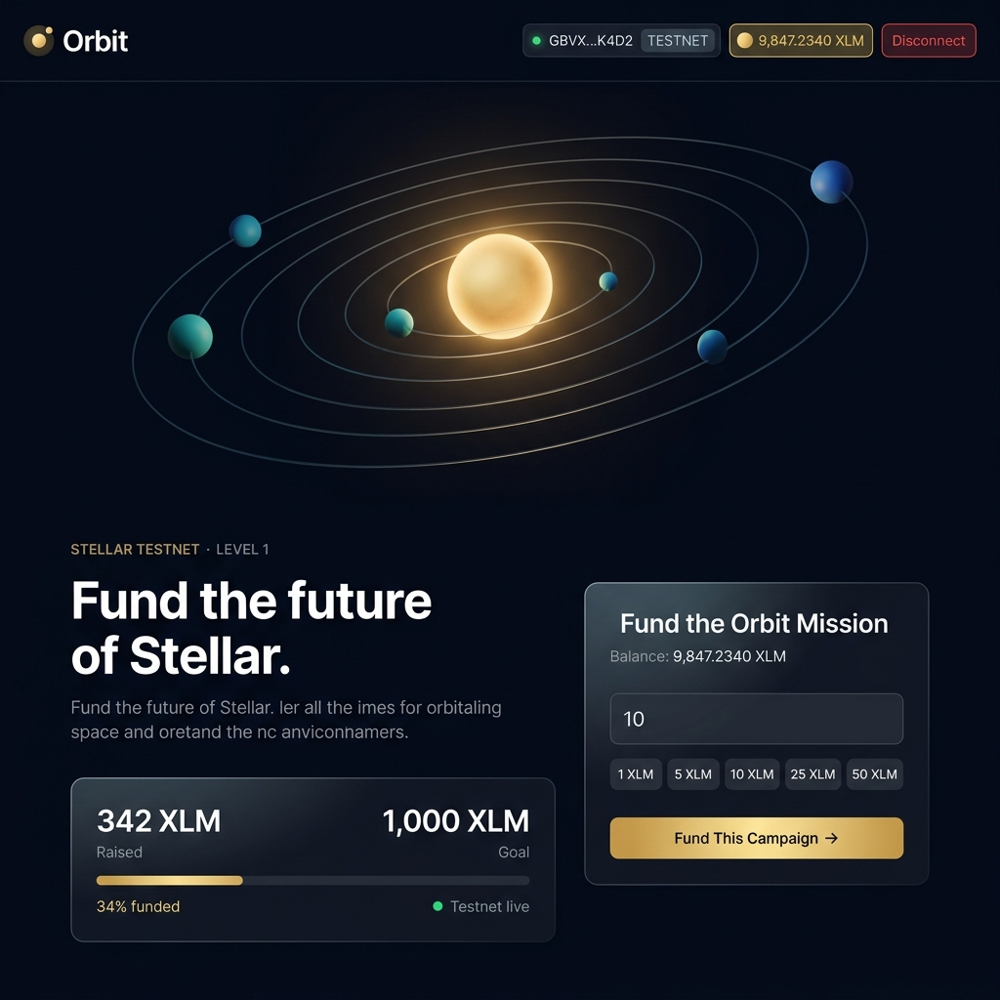
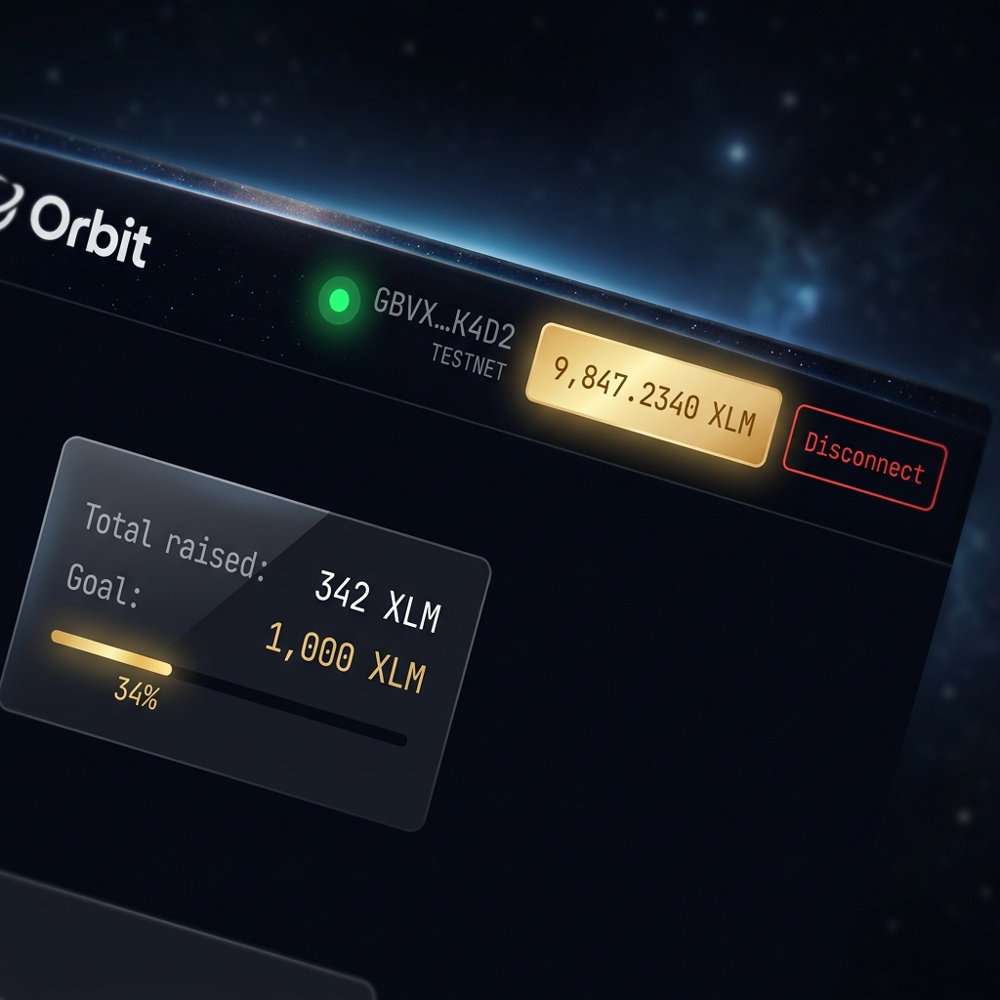
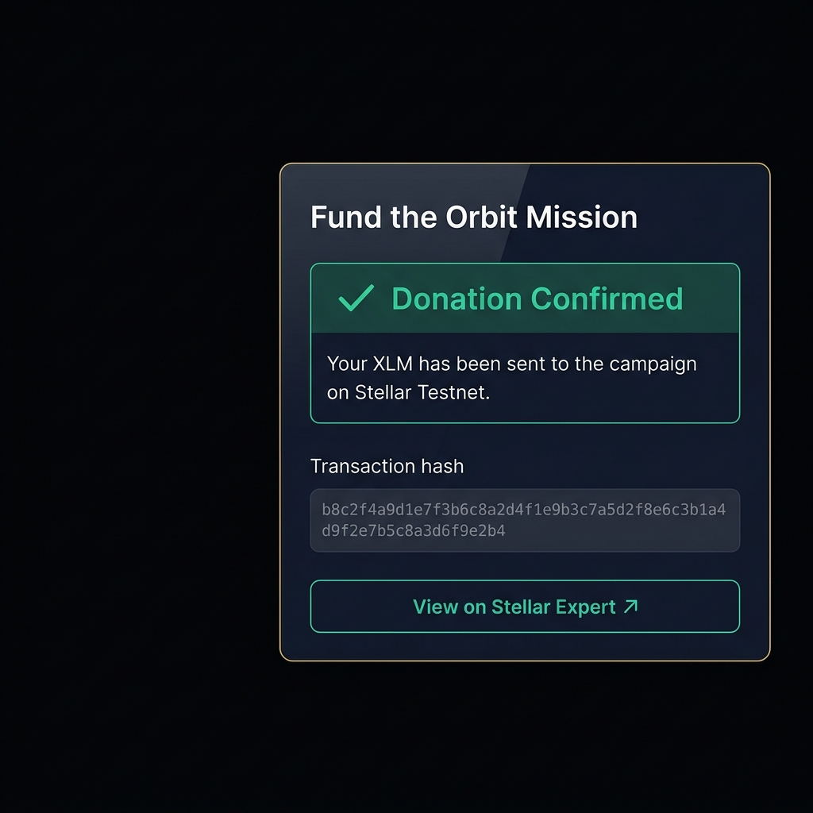
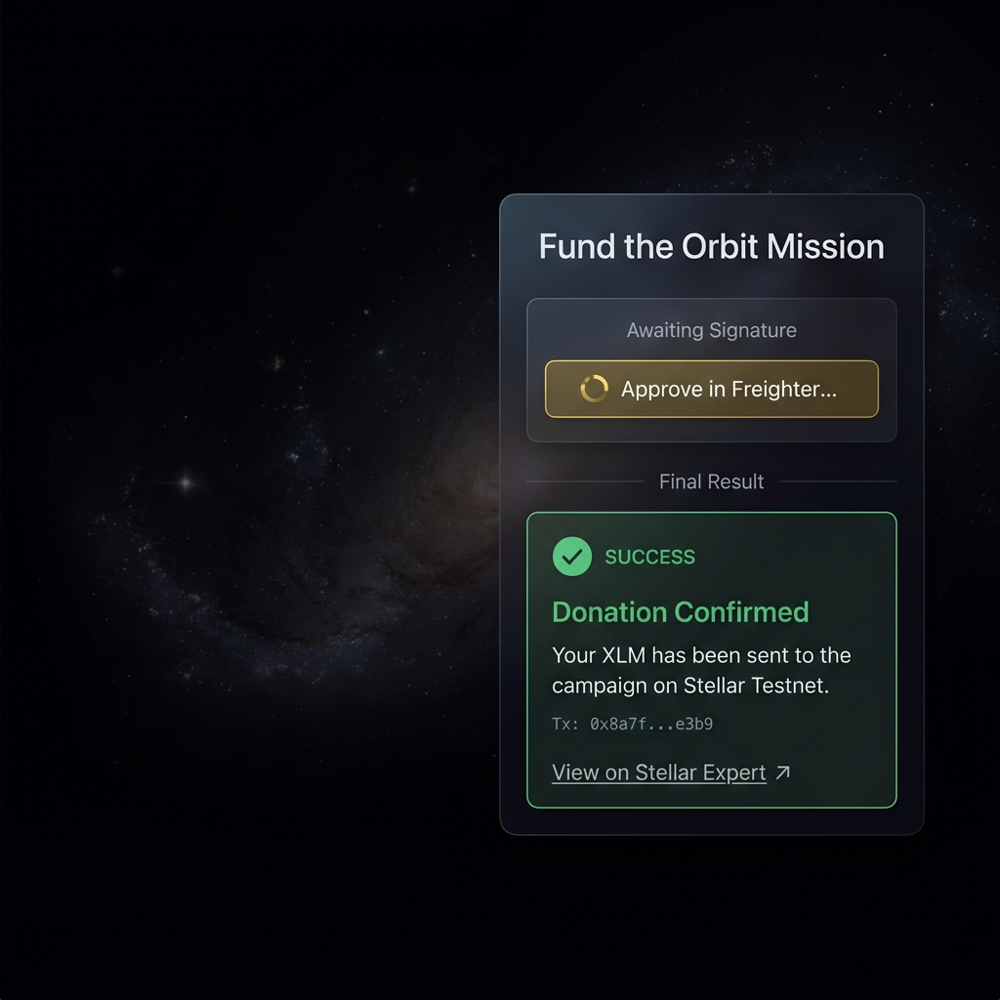

# Orbit — Stellar Crowdfunding Platform

> A crowdfunding platform built on the Stellar network. Connect your Freighter wallet and send XLM directly to campaigns — transparent, instant, trustless.

---

## Project Status

| Level | Belt | Status |
|-------|------|--------|
| Level 1 | ⬜ White Belt | ✅ Complete |
| Level 2 | 🟡 Yellow Belt | 🔜 Pending |
| Level 3 | 🟠 Orange Belt | 🔜 Pending |

---

## Level 1 — White Belt

### What's built

A single-campaign donation page on Stellar Testnet:

- **Wallet connection** — Freighter wallet connect/disconnect flow with Testnet detection
- **Balance display** — Fetches and displays connected wallet's XLM balance (auto-refreshes every 30s)
- **XLM transaction** — Sends XLM on Stellar Testnet to the campaign address via signed transaction
- **Transaction feedback** — Shows `building → awaiting_signature → submitting → success/failure` states
- **Transaction hash** — Displayed on success with clickable Stellar Expert explorer link
- **Error handling** — Specific messages for: Freighter not installed, permission denied, user rejected, insufficient balance
- **3D orbital scene** — Interactive Three.js star system; central star glow scales with campaign progress

---

### Screenshots

**1. Wallet connected state**



*Wallet address, network badge, XLM balance, and Disconnect button shown in nav*

---

**2. Balance displayed**



*XLM balance shown in nav chip (click to refresh) + campaign raise stats in progress card*

---

**3. Successful testnet transaction**



*Green "Donation Confirmed" panel with transaction hash and Stellar Expert explorer link*

---

**4. Transaction result shown to user**



*Full donation flow: pending states (building → awaiting Freighter signature → submitting) through to final success result*

---

### Tech stack

| Tool | Version | Purpose |
|------|---------|---------|
| React | 19 | UI framework |
| TypeScript | 5 | Type safety |
| Vite | 8 | Build tool |
| Tailwind CSS | v4 | Utility styling |
| Three.js + @react-three/fiber | latest | 3D orbital scene |
| @stellar/stellar-sdk | latest | Stellar transactions & Horizon API |
| @stellar/freighter-api | v6.0.1 | Wallet signing (Freighter extension) |

---

### Local setup

**Prerequisites**
- Node.js >= 18
- [Freighter wallet](https://freighter.app) browser extension installed
- Freighter configured for **Stellar Testnet** (Settings → Network → Testnet)

**Get testnet XLM**

Visit [Stellar Laboratory Friendbot](https://laboratory.stellar.org/#account-creator?network=test) and fund your testnet address before donating.

**Run locally**

```bash
git clone https://github.com/subhadip890/Orbit.git
cd Orbit
npm install
cp .env.example .env
npm run dev
```

Open `http://localhost:5173` in your browser.

**Environment variables** (`.env`)

```env
VITE_CAMPAIGN_ADDRESS=GCKFBEIYV2U22IO2BJ4KVJOIP7XPWQGQFKKWXR6DUSVTFHJDQB7C554
VITE_NETWORK_PASSPHRASE=Test SDF Network ; September 2015
VITE_HORIZON_URL=https://horizon-testnet.stellar.org
VITE_SOROBAN_RPC_URL=https://soroban-testnet.stellar.org
```

---

### Code structure

```
src/
├── hooks/
│   ├── useWallet.ts        # Freighter connect/disconnect/balance (isolated from UI)
│   └── useTransaction.ts   # XLM transfer: build → sign → submit (isolated from UI)
├── components/
│   ├── OrbitalScene.tsx    # Three.js 3D orbital star system
│   ├── Hero.tsx            # 3D scene wrapper (WebGL detection + lazy load)
│   ├── WalletPanel.tsx     # Connect/disconnect/balance display UI
│   ├── DonatePanel.tsx     # Amount input + transaction state machine UI
│   └── TransactionResult.tsx # Success/error feedback with tx hash
├── App.tsx                 # Root — assembles all components
├── main.tsx                # React entry point
└── index.css               # Design system (color tokens, typography, components)
```

### Campaign address (testnet)

`GCKFBEIYV2U22IO2BJ4KVJOIP7XPWQGQFKKWXR6DUSVTFHJDQB7C554`

Verify donations on [Stellar Expert Testnet](https://stellar.expert/explorer/testnet/account/GCKFBEIYV2U22IO2BJ4KVJOIP7XPWQGQFKKWXR6DUSVTFHJDQB7C554).

---

## Design decisions

**Color palette** — Deep space theme: `#050A1A` (void black) base with `#E8D5A3` (warm gold/starlight) primary accent, `#4ECCA3` success/teal, `#FF6B6B` error/coral. Deliberately avoids the overused purple-blue gradient AI aesthetic.

**Typography** — `Syne` (geometric display face) for headlines + `Inter` (clean, legible) for body + `JetBrains Mono` for transaction hashes/addresses.

**3D signature element** — Three.js orbital system where the central star's glow intensity scales proportionally to campaign progress (0–1 prop). Three orbiting bodies on inclined elliptical paths with Trail effects. Static gradient fallback if WebGL is unavailable. Respects `prefers-reduced-motion`.

**Code separation** — Wallet logic (`useWallet.ts`), transaction logic (`useTransaction.ts`), and each UI element are fully decoupled. Components receive only props they need.

---

## Contributing

This is a learning project built on Stellar Testnet. All transactions use testnet funds — no real XLM involved.

---

*Orbit · Built on [Stellar](https://stellar.org) Testnet · White Belt Level 1*
